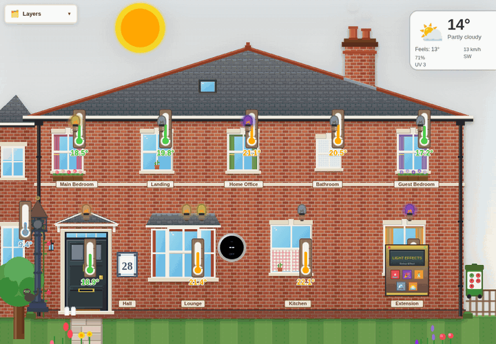
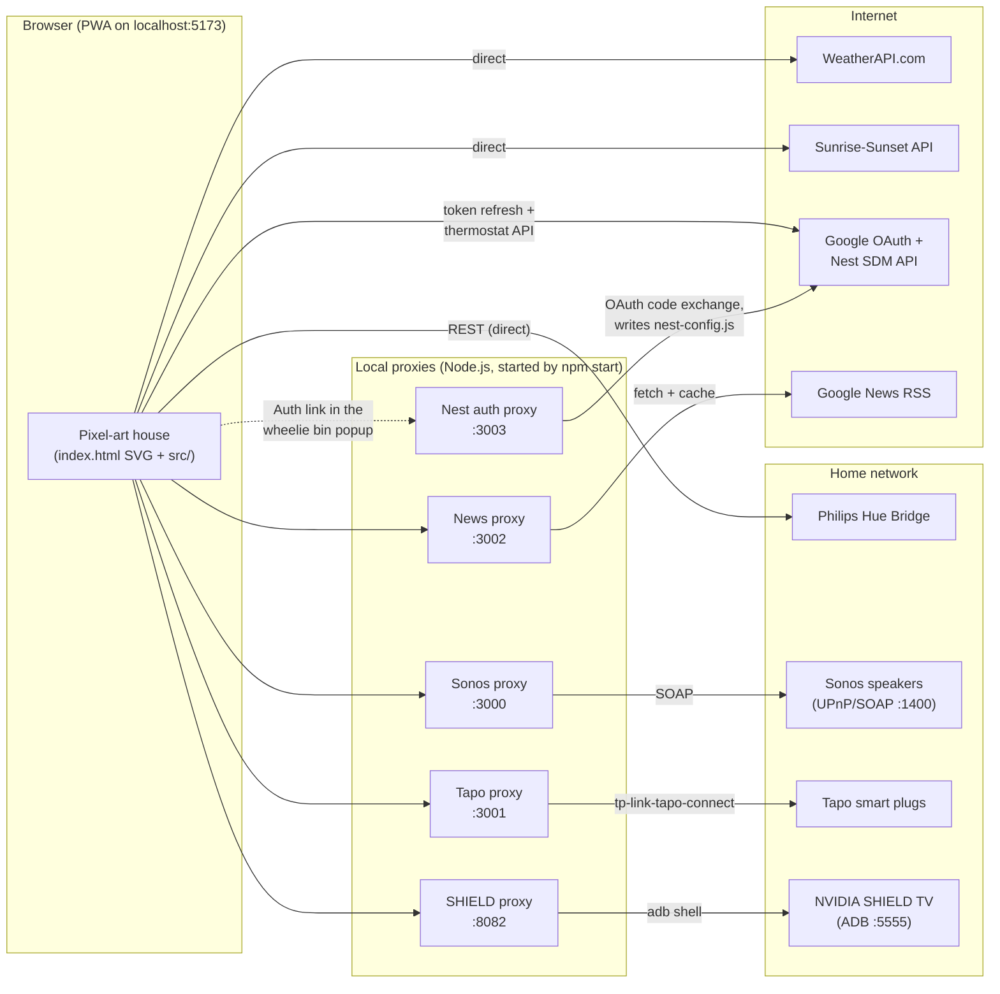
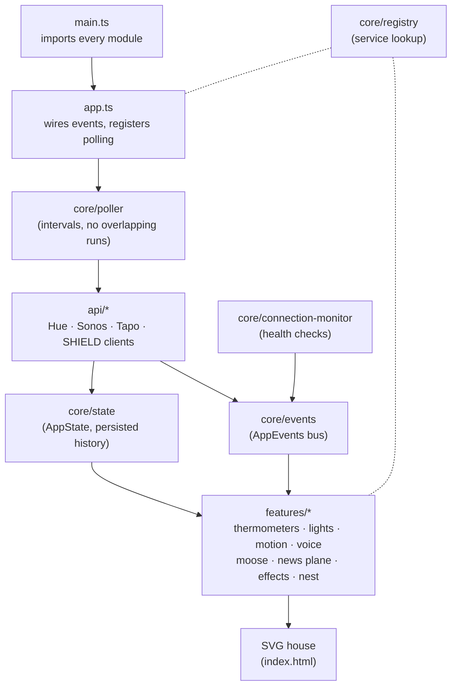

# Home Monitor Dashboard

A cosy, real-time smart home dashboard drawn as a pixel-art UK semi-detached house. It shows live data from Philips Hue sensors and controls Sonos speakers, TP-Link Tapo smart plugs, an NVIDIA SHIELD TV and a Google Nest thermostat. It's built as an installable Progressive Web App (PWA).



_Above: someone walks into the hall, the kitchen light comes on, Monty the Moose drops by to clean a window, and the house lights up as night falls._

## Features

**House and sensors**

- **Temperatures:** a pixel thermometer for every room plus outdoors, colour-coded, with 24-hour history and sparkles on each update
- **Motion:** a monkey pops up where motion is detected, with a voice announcement and a 48-hour activity log
- **Lights:** each bulb is drawn in the real colour of its Hue light (hue/saturation, colour temperature or CIE xy). Click a bulb to open a colour picker, double-click it to toggle. A Victorian lamppost follows the outdoor lights
- **Light effects:** a jukebox runs Red Alert, Party, Disco, Wave and Sunset, then restores every light to how it was

**Devices**

- **Sonos:** play, pause and volume for each discovered speaker
- **Tapo smart plugs:** UK-socket switches, auto-discovered on the network
- **NVIDIA SHIELD TV:** a remote that launches Netflix, YouTube, Plex, Spotify and more
- **Nest thermostat:** current/target temperature and heating status. Shift-drag the thermostat to change the setpoint

**Atmosphere**

- Day/night sky from real sunrise/sunset times, with sun, moon and stars. Windows glow warm after dark
- Live weather from WeatherAPI.com, with rain, snow and fog effects
- **Monty the Moose** visits every 10–20 minutes to mow the lawn, water the plants or star-gaze
- A news plane flies past towing the latest headline
- Chimney smoke, clouds, birds, a garden cat and milk bottles on the step

**App**

- The wheelie bin's LEDs show which services are online. Click it for details and Nest authorisation
- Every element is draggable, and positions are remembered
- A layers panel shows or hides each group of elements
- Installable PWA with offline support

## How it fits together

The browser talks straight to services that allow it: the Hue Bridge, the weather and sunrise APIs, and Google's Nest API. Devices that can't be reached from a web page go through small local Node.js proxies. They might use SOAP, ADB or an authenticated protocol, or not send CORS headers. `npm start` launches every proxy, waits for them to report healthy, then starts Vite.



| Proxy  | Port | Why it exists                                                                                                                              | Talks to                         |
| ------ | ---- | ------------------------------------------------------------------------------------------------------------------------------------------ | -------------------------------- |
| Sonos  | 3000 | Browsers can't make SOAP/UPnP calls to speakers. Discovers speakers by scanning the subnet and only forwards to speakers it has discovered | Sonos speakers on port 1400      |
| Tapo   | 3001 | Tapo plugs need an authenticated, encrypted session. Discovers plugs and rediscovers them every 5 minutes                                  | Tapo plugs (credentials in .env) |
| News   | 3002 | Google News RSS has no CORS. Parses it to JSON and caches it for 10 minutes                                                                | news.google.com                  |
| Nest   | 3003 | Handles the OAuth redirect and code exchange, then saves tokens to `nest-config.js`                                                        | Google OAuth                     |
| SHIELD | 8082 | Launching apps needs ADB                                                                                                                   | SHIELD over ADB (port 5555)      |

Each proxy exposes `GET /health`, which the dashboard polls to light the wheelie bin's LEDs.

### Inside the front end

Feature modules don't call each other directly. A central poller fetches data, results go into a reactive state store, and features react to events on an event bus.



## Quick start

### Prerequisites

- Node.js 18+
- On the same network as your devices (a VPN can block local access)
- [ADB](https://developer.android.com/tools/releases/platform-tools) on your PATH if you want SHIELD control

### Install and run

```bash
git clone https://github.com/ChrisBrooksbank/home-monitor.git
cd home-monitor
npm install

cp config.example.js config.js   # Hue bridge + weather settings
cp .env.example .env             # Tapo credentials

npm start                        # all proxies + Vite
```

Then open <http://localhost:5173>.

### Files that are not in git

| File               | Purpose                                | Create from                                          |
| ------------------ | -------------------------------------- | ---------------------------------------------------- |
| `config.js`        | Hue Bridge IP/username, WeatherAPI key | `config.example.js`                                  |
| `.env`             | Tapo email and password                | `.env.example`                                       |
| `nest-config.json` | Nest OAuth client details (optional)   | `nest-config.example.json`                           |
| `nest-config.js`   | Nest tokens for the browser (optional) | Written automatically when you authorise (see below) |

## Configuration

### Hue Bridge (required)

Edit `config.js`:

```javascript
const HUE_CONFIG = {
    BRIDGE_IP: '192.168.1.XXX',
    USERNAME: 'your-hue-api-username',
};
window.HUE_CONFIG = HUE_CONFIG;
```

Keep the `window.` lines from the example: the app reads its settings from `window`.

To find your bridge, run `npx tsx src/scripts/setup/find-hue-bridge.ts`.

Room names come from sensor and light names via the patterns in `src/config/mappings.ts`. Edit that file if your devices are named differently.

### Weather (optional)

Sign up at [weatherapi.com](https://www.weatherapi.com/signup.aspx), then add to `config.js`:

```javascript
const WEATHER_CONFIG = {
    API_KEY: 'your-api-key',
    LOCATION: 'CM1 6UG',
};
window.WEATHER_CONFIG = WEATHER_CONFIG;
```

### Tapo plugs (optional)

Put your Tapo account details in `.env`:

```env
TAPO_EMAIL=you@example.com
TAPO_PASSWORD=your-password
```

The proxy scans `192.168.68.50–90` by default. Override this with `TAPO_BASE_IP`, `TAPO_SCAN_START` and `TAPO_SCAN_END`. Sonos uses `SONOS_BASE_IP`, `SONOS_SCAN_START` and `SONOS_SCAN_END`.

### Nest thermostat (optional)

1. **Google Cloud:** in the [Cloud Console](https://console.cloud.google.com/), enable the **Smart Device Management API**. Then create an **OAuth client ID** (Web application) with redirect URI `http://localhost:3003/auth/callback`.
2. **Device Access:** create a project in the [Device Access Console](https://console.nest.google.com/device-access) ($5 one-time fee), add your OAuth client ID, and note the **Project ID**.
3. **Configure:** copy `nest-config.example.json` to `nest-config.json` and fill in `CLIENT_ID`, `CLIENT_SECRET` and `PROJECT_ID`.
4. **Authorise:** run `npm start`, click the **wheelie bin**, then the **Auth** link next to Nest, and finish signing in. The tokens are saved automatically.

If you see "Token has been expired or revoked", click **Auth** again. No command line is needed.

## Development

```bash
npm start              # Vite + all proxies (recommended)
npm run dev            # Vite only (port 5173)
npm run build          # Production build to dist/

npm run proxy:sonos    # Individual proxies
npm run proxy:tapo
npm run proxy:news
npm run proxy:nest
npm run proxy:shield

npm test               # Vitest (watch)
npm run test:run       # Vitest once
npm run lint           # ESLint
npx tsc --noEmit       # Type check
npm run format         # Prettier
npm run knip           # Unused code / exports / dependencies
```

Check the proxies are up:

```bash
for port in 3000 3001 3002 3003 8082; do curl -s localhost:$port/health; echo; done
```

### Project structure

```
index.html               SVG house and page markup
css/main.css             Styles and animations
config.example.js        Template for config.js (Hue, weather)
src/
├── main.ts              Entry point: imports every module
├── app.ts               Wires events, loads Hue data, registers polling
├── core/                registry, events, state, poller, connection-monitor, initializer
├── api/                 Clients for Hue, Sonos, Tapo, SHIELD
├── features/            Thermometers, lights, motion, voice, sky, weather, nest,
│                        sonos, tapo, shield, effects, moose, news plane
├── ui/                  Draggable, colour picker, layers panel
├── config/              Constants, room mappings, Zod schemas, Config facade
├── utils/               Logger, helpers (retry, intervals), colour utils
├── proxies/             Sonos, Tapo, News, Nest and SHIELD proxy servers
├── scripts/             start.ts (launcher) and setup/ (device discovery)
└── types/               Shared TypeScript types
scripts/                 Older CLI tools for device control and testing
docs/demo.gif            The animation at the top of this README
```

### Polling intervals

| Data              | Interval |
| ----------------- | -------- |
| Motion sensors    | 3 s      |
| Lights            | 10 s     |
| Connection status | 30 s     |
| Sonos volume      | 30 s     |
| Tapo status       | 30 s     |
| Temperatures      | 60 s     |
| Sky               | 60 s     |
| Weather           | 15 min   |
| Nest              | 15 min   |
| Sunrise/sunset    | 24 h     |

All intervals are set in `src/config/constants.ts`.

## Troubleshooting

- **Wheelie bin LEDs are red:** click the bin to see which service is down. For proxies, make sure `npm start` is running and nothing else is using ports 3000–3003 or 8082.
- **No Hue data:** check that `config.js` exists, has the right bridge IP and username, and keeps the `window.HUE_CONFIG = HUE_CONFIG;` line.
- **"Unexpected token '<'" or stale UI:** clear site data (DevTools → Application → Storage → Clear site data), then hard-refresh.

## Built with

[Claude Code](https://claude.com/claude-code)
